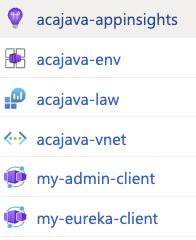
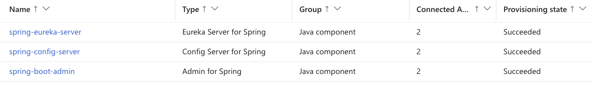
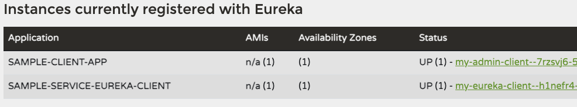

# Azure Container Apps with Java Components

Do you have Java Spring Boot applications running on Azure Spring Apps, which is being [retired on March 31, 2028](https://azure.microsoft.com/en-us/updates?id=azure-spring-apps-will-be-retired-on-march-31-2028)? Planning to migrate to Azure Container Apps but struggling with Terraform templates for Java Components?

Look no further! This repository provides a solution using Terraform AzAPI provider, which ensures support for the latest ARM specifications for Azure Container Apps and its Java components. 

The templates are based on the [Microsoft Learn sample](https://learn.microsoft.com/en-us/azure/container-apps/java-eureka-server?tabs=azure-cli).

## Architecture Components

The deployment creates the following Java components in Azure Container Apps:
- Spring Cloud Eureka Server (`spring-eureka-server`) for service discovery
- Spring Boot Admin (`spring-boot-admin`) for application monitoring
- Spring Cloud Config Server (`spring-config-server`) for centralized configuration
- Two client applications demonstrating the integration

## Prerequisites

- Azure CLI
- Terraform
- An Azure subscription
- A `config.tfvars` file with required variables

## Resource Configuration

### Java Components Creation
```terraform
# Spring Cloud Eureka Server
resource "azapi_resource" "SpringEurekaServer" {
  type = "Microsoft.App/managedEnvironments/javaComponents@2024-02-02-preview"
  name = "spring-eureka-server"
  body = jsonencode({
    properties = {
      componentType = "SpringCloudEureka"
      configurations = [
        {
          propertyName = "eureka.server.renewal-percent-threshold"
          value        = "0.85"
        }
      ]
    }
  })
}

# Spring Boot Admin
resource "azapi_resource" "SpringBootAdmin" {
  type = "Microsoft.App/managedEnvironments/javaComponents@2024-02-02-preview"
  name = "spring-boot-admin"
  body = jsonencode({
    properties = {
      componentType = "SpringBootAdmin"
      ingress       = {}
    }
  })
}
```

### Service Binding Configuration
```terraform
# Container App with Java Component Bindings
resource "azapi_resource" "my-eureka-client" {
  type = "Microsoft.App/containerApps@2024-03-01"
  name = "my-eureka-client"
  body = jsonencode({
    properties = {
      template = {
        containers = [{
          name  = "eureka-client"
          image = "mcr.microsoft.com/javacomponents/samples/sample-service-eureka-client:latest"
        }]
        serviceBinds = [
          {
            name      = azapi_resource.SpringEurekaServer.name
            serviceId = azapi_resource.SpringEurekaServer.id
          },
          {
            name      = azapi_resource.SpringBootAdmin.name
            serviceId = azapi_resource.SpringBootAdmin.id
          }
        ]
      }
    }
  })
}
```

### Key Features
- Uses `@2024-02-02-preview` API version for Java Components
- Uses `@2024-03-01` API version for Container Apps
- Service bindings connect apps to Java components
- Supports multiple component configurations
- Includes ingress settings for admin monitoring

### Container Apps
Two container apps are deployed:
- `my-eureka-client`: 
  - Image: `mcr.microsoft.com/javacomponents/samples/sample-service-eureka-client:latest`
  - Resources: 1 CPU core, 0.5Gi memory
- `my-admin-client`: 
  - Image: `mcr.microsoft.com/javacomponents/samples/sample-admin-for-spring-client:latest`
  - Resources: 0.5 CPU core, 0.5Gi memory

## Deployment

1. Initialize Terraform:
```bash
terraform init -upgrade
```

2. Deploy the infrastructure:
```bash
terraform apply -var-file=config.tfvars
```

## Deployment Results

### Azure Resources

- Application Insights (`acajava-appinsights`)
- Container Apps Environment (`acajava-env`)
- Log Analytics Workspace (`acajava-law`)
- Virtual Network (`acajava-vnet`)
- Container Apps:
  - `my-admin-client`
  - `my-eureka-client`

### Java Components Status

All Java components deployed successfully with 2 connected apps each:
- `spring-eureka-server`: Eureka Server for Spring
- `spring-config-server`: Config Server for Spring
- `spring-boot-admin`: Admin for Spring

### Eureka Service Registry

Services successfully registered with Eureka:
- `SAMPLE-CLIENT-APP` (my-admin-client)
- `SAMPLE-SERVICE-EUREKA-CLIENT` (my-eureka-client)

Both services are UP and running in their respective availability zones.

## Reference Documentation

- [Azure Container Apps REST API Template](https://learn.microsoft.com/en-us/azure/templates/microsoft.app/containerapps?pivots=deployment-language-terraform)
- [Java Component REST API Template](https://learn.microsoft.com/en-us/azure/templates/microsoft.app/managedenvironments/javacomponents?pivots=deployment-language-terraform)
- [Java Components in Container Apps](https://learn.microsoft.com/en-us/azure/container-apps/java-overview)
